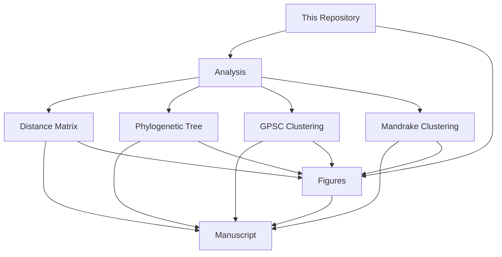

<h1 align="center">
 cgMLST and LINcodes Typing Schemes
</h1>


  


<p align="center">
  
</p>

# Overview
This repository originally contained code to run analyses and generate figures for the:  
<a href=https://www.microbiologyresearch.org/content/journal/mgen/10.1099/mgen.0.001280>Pneumococcal Genome Library cgMLST Typing Scheme Manuscript</a>
</p>  
The same codebase was later adapted to accommodate analyses and create figures for two additional manuscripts:

<a href=https://www.biorxiv.org/content/10.1101/2025.03.29.646111v1>*S. aureus* cgMLST Typing Scheme Manuscript</a>  
 <a href=https://www.biorxiv.org/content/10.1101/2025.04.30.651387v1>*M. catarrhalis* cgMLST Typing Scheme Manuscript</a>


> [!NOTE]  
> To generate the:  
>* MST cluster analysis, please refer to: Analysis --> Profile clustering section  
>* Pairwise Allelic Mismatches plot, please refer to: Figures --> Figure 2a and 2b  
>* Rand Index plot, please refer to: Figures --> Figure 4e
>

 

# Codebook
This repository contains two main folders: `Analysis` and `Figures`. 

<details>
<summary>View folder contents</summary>
<ol>
  <li>Analysis - contains the code used to generate:</li>
  <ol>
      <li>the distance matrix</li>
      <li>the phylogenetic tree</li>
    <li>GPSC and Mandrake clustering</li>
    </ol>
  <li>Figures - contains the R code  used to generate main and supplementary figures</li>
</ol>
</details>



```diff
- The flowchart above may not render upon first loading
+ Hit refresh on your browser to fix this
+ Alternatively, hit the <--> button to view in a pop-out window
```


## Publications
|**Publication**|**DOI**|
|-------------------------------|------|
|[*MGen* 2024](https://www.microbiologyresearch.org/content/journal/mgen/10.1099/mgen.0.001280)||  
|[*bioRxiv* 2025](https://www.biorxiv.org/content/10.1101/2025.03.29.646111v1)|| 
|[*bioRxiv* 2025](https://www.biorxiv.org/content/10.1101/2025.04.30.651387v1)||  
>[!TIP]
**Useful Links for LINcodes**
>
>Below are helpful resources to learn more about LINcodes (Life Identification Numbers):   
>https://pubmed.ncbi.nlm.nih.gov/35700230/  
>https://www.biorxiv.org/content/10.1101/2024.03.11.584534v1.full
>
>Additional information about how PubMLST deals with LINcodes can be found here [BIGSdb documentation chapter 5.24](https://readthedocs.org/projects/bigsdb/downloads/pdf/latest/).

# Contact
If you have any queries, suggestions or concerns, please contact [Angela Brueggemann](mailto:angela.brueggemann@ndph.ox.ac.uk).  

# License
Distributed under the GNU General Public License v3.0. Please see `LICENSE` for more information.

|Repository `PUBLIC` status since: 30/05/2024|
|--------------------------------------------|
